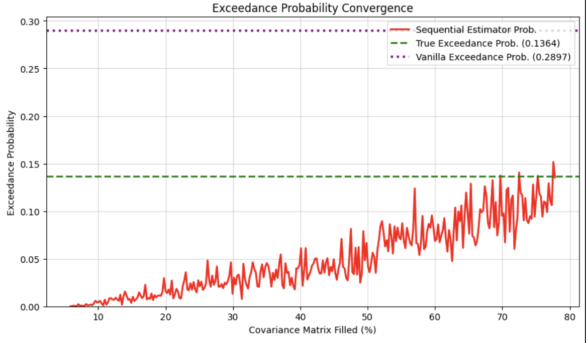
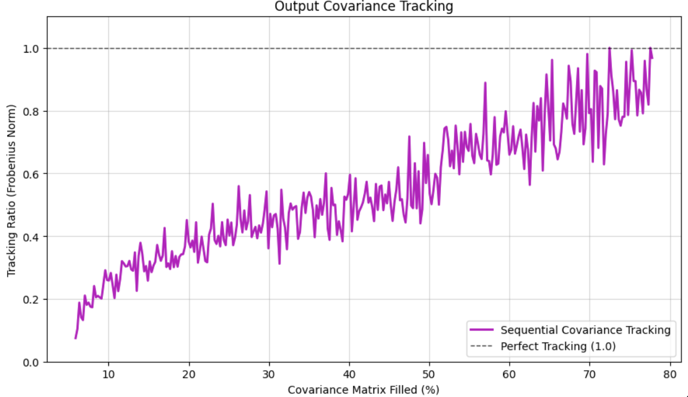
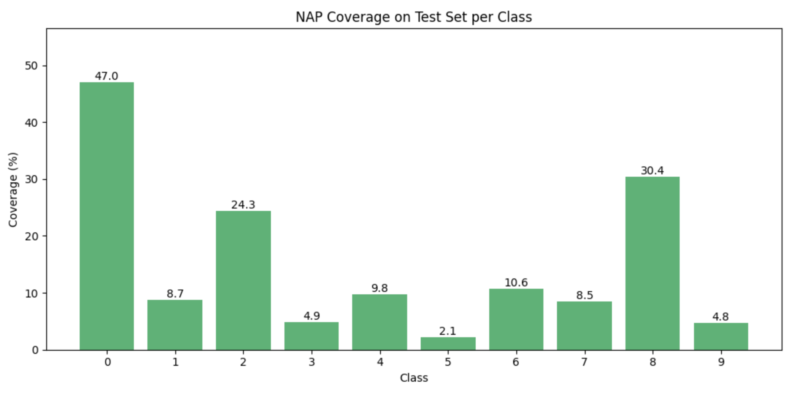
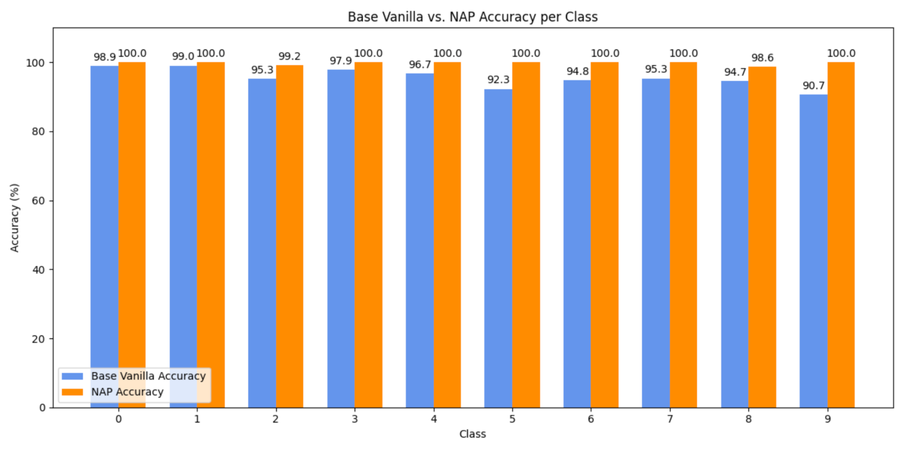

# Verifying-LLMs-Research-Sprint

Some early research work into constructing a "probabilistic verifier" to look at a neural network’s activations and estimate the likelihood that the network has a certain property over a range of inputs (without requiring exhaustive analysis of all possible network interactions). Using estimation rather than guarantees allows us to work with much larger NNs than current formal verification methods. (Work In Progress)

### Adversarial Probabilistic Verification

### Layer-By-Layer Activation Modeling

### Neural Activation Patterns

### Low Probability Estimation

### Mechanistic Anomaly Detection

> **Project** **Summary** style="width:3.42708in;height:1.98958in" />

We ran some early experiments for two different estimators. Each begins
from a presumption of independence and gradually adds arguments until
hopefully converging to a result. We focus on the LPE task as a proof of
concept but hope to extend to probabilistic verification (ie. LPE with
confidence intervals) and runtime monitoring.

> **Layer-By-Layer** **Activation** **Modelling** **(GSE)**

First, we implemented an estimator to find the probability that a small
NN’s output exceeded the range \[-5, 5\]. Then, we applied the estimator
to find the probability of generating a specific token (LPE). Finally,
we scaled the estimator to a 10M parameter LLM. We follow a post taking
inspiration from ARC’s work on estimating tail risks in NNs \[1\].

> 1\. Method: We pass samples through the first layer of a network and
> then fit a Gaussian to the distribution of activations, then sample
> from the first distribution and pass through the second layer to fit
> our second Gaussian. We continue through the network until we obtain
> the estimated output distribution. At each layer, we also create a
> mask to track a select number of covariances (here, a heuristic
> argument is a group of masks over the full network).
>
> 2\. Results: While this approach still feels theoretically
> unsatisfying because it is not possible to fully accurately estimate
> the net without considering higher moments (and for all of the reasons
> listed here \[2\]), the results were promising. First, the tracking
> ratio (estimated distribution norm / true distribution norm) saturates
> when the covariance matrix is ~70% filled, allowing the estimator to
> find the true probability without needing to consider the full
> network. Our estimator converges to the correct probability while the
> vanilla method (simply sampling inputs to create an output
> distribution at the last layer) does poorly.
>
>  style="width:4.13542in;height:2.26042in" />Next, the estimator works
> better as model size increases, outperforming Quadratic Logit
> Decomposition on the gelu-4l model (with an Itakura–Saito loss of
> 1.7297 compared with QLD’s score of 2.1615). It still underperforms
> the importance sampling methods in the paper, but feels like an
> improvement for activation extrapolation methods. It also ran ~20
> times faster than both MHIS and ITGIS.

> **Collecting** **Neural** **Activation** **Patterns** **(NAPs)**

A feature we’d like to have is that as the compute/number of samples
goes to infinity, the estimator converges to true formal verification.
To obtain theoretically perfect estimation with layer-by-layer
modelling, we might need complicated techniques like GMMs or Kernel
Density Estimation at each layer. NAPs provide an easier route.

> 1\. Method: For each certified datapoint, track its most important
> activated features by setting a threshold that features need to meet
> to be considered “activated” (all other features can have any value).
> This carves out regions in input space corresponding to each certified
> datapoint. Here, the presumption of independence would correspond to a
> NAP consisting of the empty set (which would cover the full input
> space), and arguments would be sets of features to track for each
> input in the training dataset. We can refine regions by adding more
> and more features to our tracked set, add more NAPs by sampling unique
> inputs, and merge NAPs. At the end of the process, we should have a
> useful segmentation of parts of input space.
>
> 2\. Results: To perform LPE, we could maintain separate Gaussian
> distributions for different activation regions so that the full output
> distribution becomes a mixture of Gaussians. For each activation
> region, propagation is also faster because we only need to track the
> activated neurons.
>
> Most importantly, in deployment, if a certain NAP arises, we can be
> more confident that the model will output a correct response (ie. a
> certain pattern in a math setting indicates the model will not
> hallucinate, a certain pattern in the geography setting indicates the
> model will not hallucinate, etc). This feels like a natural step for
> automated interpretability work: if we can automatically identify
> important features/pathways leading to a model output, we should be
> able to segment the input space in an automated way too.

The diagrams above show early experiments with the MNIST dataset (each
NAP corresponds to an output class). On average, a NAP captures 15% of
the inputs from its target class, yet those captured inputs lead to 100%
accuracy in most classes. This shows the value of picking an optimal
threshold.

\[1\] Concrete Methods for Heuristic Estimation on Neural Networks

\[2\] Estimating Tail Risk in Neural Networks

